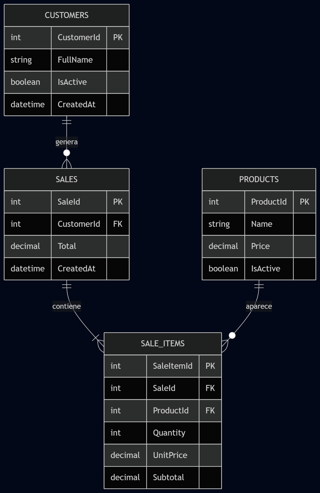

🛒 QuickSale – Sistema de Registro de Ventas
QuickSale es una aplicación web para la gestión rápida de ventas.
El ecosistema combina:

🎨 Frontend legacy optimizado (Angular 6)

⚙️ Backend de alto rendimiento (ASP.NET Web API .NET 4.7)

🗄️ Persistencia en SQL Server mediante Stored Procedures

🔁 Procesamiento transaccional usando XML para operaciones atómicas

📂 Estructura del Proyecto

La solución está organizada por capas para facilitar mantenibilidad y escalabilidad.

📁 Estructura General

```
QuickSale/
├── Front/
│   └── quick-sale-front/       # Proyecto Angular 6 (Frontend)
│       ├── src/app/            # Componentes, Servicios y Modelos
│       └── angular.json        # Configuración de compilación
│
├── Back/
│   └── QuickSale/              # ASP.NET Web API (.NET 4.7)
│       ├── Controllers/        # Endpoints (Sales, Products, Customers)
│       ├── Models/             # DTOs y Entidades
│       └── Web.config          # Cadenas de conexión y settings
│
└── DB/
    └── script.sql        # Script completo (DB, Tablas, Datos y SP)
```

🧱 Arquitectura Interna del Backend

```
QuickSale/
├─ Application/
│  ├─ Controllers/          # SalesController, CatalogsController
│  └─ App_Start/            # WebApiConfig, SwaggerConfig
│
├─ Business/
│  ├─ Services/             # SaleService, CatalogService
│  └─ DTOs/                 # SaleRequestDto, SaleResponseDto
│
└─ Infrastructure/
   ├─ Context/              # SalesDbContext
   ├─ Entities/             # Customer, Product
   └─ Repositories/         # SaleRepository
```

Arquitectura basada en separación por capas:
Application → Exposición HTTP
Business → Lógica de dominio
Infrastructure → Acceso a datos

🚀 Guía de Inicio Rápido
1️⃣ Requisitos Previos
| Tecnología     | Versión                        |
| -------------- | ------------------------------ |
| Node.js        | 18+ (requiere legacy provider) |
| Angular CLI    | 6.x                            |
| .NET Framework | 4.7                            |
| SQL Server     | 2012+                          |
| SSMS           | Recomendado                    |


2️⃣ Configuración de Base de Datos
Abrir SQL Server Management Studio
Ejecutar el script:

[Database script](Db/script.sql )
El script crea automáticamente:

Base de datos QuickSale
Tablas con integridad referencial
Datos de prueba
Stored Procedure sp_CreateSale


⚙️ Lógica Transaccional
El SP:
Recibe el detalle de venta en formato XML
Procesa cabecera + detalle
Ejecuta todo en una única transacción atómica

3️⃣ Ejecución del Frontend (Angular 6)
Instalar dependencias:
npm install
npm start

Si presenta error por OpenSSL:
En Windows (CMD)
set NODE_OPTIONS=--openssl-legacy-provider && ng serve
En PowerShell
$env:NODE_OPTIONS="--openssl-legacy-provider"; ng serve

## Aplicación disponible en:
http://localhost:4200

📊 Modelo Entidad–Relación (ERD)
Base de datos normalizada con soporte de auditoría básica.

Entidades principales:

- Customers → Información de clientes (IsActive)

- Products → Catálogo con control de vigencia

- Sales → Cabecera de venta

- SaleItems → Detalle con precio histórico



🔌 API Endpoints

| Método | Endpoint                   | Acción                               | Descripción                   |
| :----: | -------------------------- | ------------------------------------ | ----------------------------- |
|   GET  | `/`                        | `HomeController.Index`               | Redirige a Swagger            |
|   GET  | `/api/products`            | `CatalogsController.GetProducts`     | Lista productos activos       |
|   GET  | `/api/customers`           | `CatalogsController.GetCustomers`    | Lista clientes activos        |
|  POST  | `/api/sales`               | `SalesController.CreateSale`         | Crea una nueva venta          |
|   GET  | `/api/sales/{id:int}`      | `SalesController.GetSale`            | Obtiene venta por ID          |
|   GET  | `/api/sales/customer/{id}` | `SalesController.GetSalesByCustomer` | Lista ventas por cliente      |
|   GET  | `/swagger/ui/index`        | Swagger UI                           | Documentación interactiva API |


🛠️ Arquitectura Técnica

🔹 Backend (.NET 4.7)

- Patrón: Web API + Inyección de Dependencias

- Persistencia: Stored Procedures

- Transacciones: XML + procesamiento en base de datos

- Atomicidad garantizada en creación de ventas

## Flujo de creación de venta:
Frontend → API → XML → Stored Procedure → Commit

## Optimizado para:

- Reducir roundtrips
- Garantizar consistencia
- Mejorar performance


🔹 Frontend (Angular 6)

- UI moderna tipo Quick Sale
- Bootstrap 4 + Flexbox
- Manejo de carrito en memoria
- Validaciones en tiempo real
- Redirección automática post-inserción usando SCOPE_IDENTITY

📌 Características Técnicas Destacadas

- Arquitectura en capas desacoplada
- Transacciones atómicas
- Integridad referencial en BD
- Separación DTO / Entidades
- Soporte Swagger
- Compatible con entornos legacy